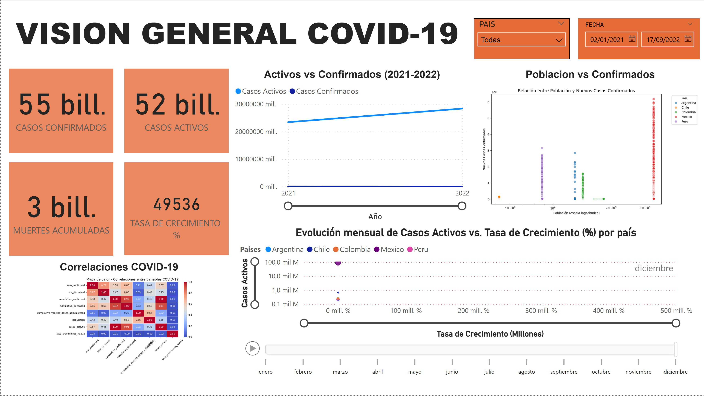

# COVID Analytics — Python + Power B

**Stack:** Python (pandas, NumPy, matplotlib/seaborn) · Power BI  
**Archivos:** [CSV](data/processed/DatosFinalesFiltrado.csv) · [Notebook](notebooks/Biogenesys.ipynb) · [PBIX](powerbi/Biogenesys.pbix) · [Informe PDF](docs/Biogenesys.pdf)

---

## 🎯 Objetivo
Explorar y modelar un dataset grande relacionado con COVID para:
- limpiar y normalizar datos (Python),
- generar KPIs y visualizaciones exploratorias,
- y presentar un **dashboard** ejecutivo en Power BI.

---

## 🗂️ Datos
- **Fuente procesada:** [`data/processed/DatosFinalesFiltrado.csv`](data/processed/DatosFinalesFiltrado.csv)  
- El cuaderno principal documenta la transformación y EDA: [`notebooks/Biogenesys.ipynb`](notebooks/Biogenesys.ipynb)

---

## 🔧 Proceso (Python)
1. Carga de CSV y tipificación de columnas.  
2. Limpieza: nulos, outliers, consistencia de fechas/categorías.  
3. Enriquecimiento: features temporales y métricas agregadas.  
4. EDA: distribuciones, series de tiempo, correlaciones.  
5. Export final a `data/processed/` para consumir en Power BI.

> Todos los pasos reproducibles en el notebook: **[`Biogenesys.ipynb`](notebooks/Biogenesys.ipynb)**.

---

## 📊 Dashboard (Power BI)
Vista ejecutiva con KPIs y tendencias (ejemplo de portada):



- Archivo del panel: **[`powerbi/Biogenesys.pbix`](powerbi/Biogenesys.pbix)**  
  > GitHub no previsualiza PBIX; al abrir el enlace se descarga para usar en **Power BI Desktop**.

---

## 📄 Informe
Metodología, hallazgos y capturas clave: **[`docs/Biogenesys.pdf`](docs/Biogenesys.pdf)**

---

## ▶️ Cómo reproducir (rápido)
1. Clona o descarga este repo.  
2. (Opcional) Crea un entorno e instala dependencias habituales:
   ```bash
   pip install pandas numpy matplotlib seaborn jupyter

3.	Abre y ejecuta el notebook: notebooks/Biogenesys.ipynb.
4.	Abre el PBIX powerbi/Biogenesys.pbix en Power BI Desktop y refresca.

├─ data/
│  └─ processed/
│     └─ DatosFinalesFiltrado.csv
├─ notebooks/
│  └─ Biogenesys.ipynb
├─ powerbi/
│  └─ Biogenesys.pbix
├─ docs/
│  └─ Biogenesys.pdf
└─ img/
   └─ biogenesys.jpeg

Autor: Eric Sanchez — Data Analyst (Admin & Finance)
